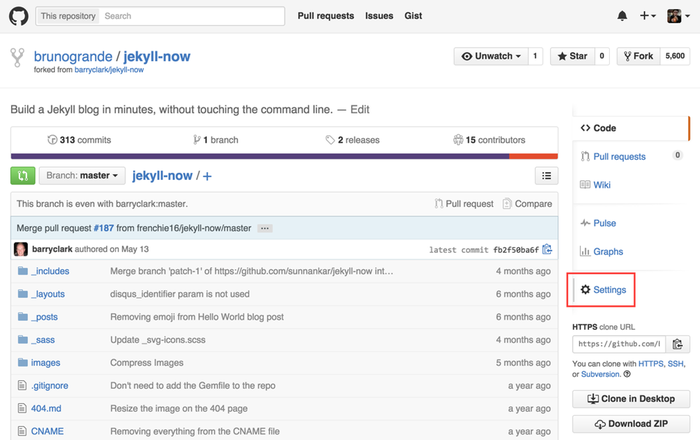
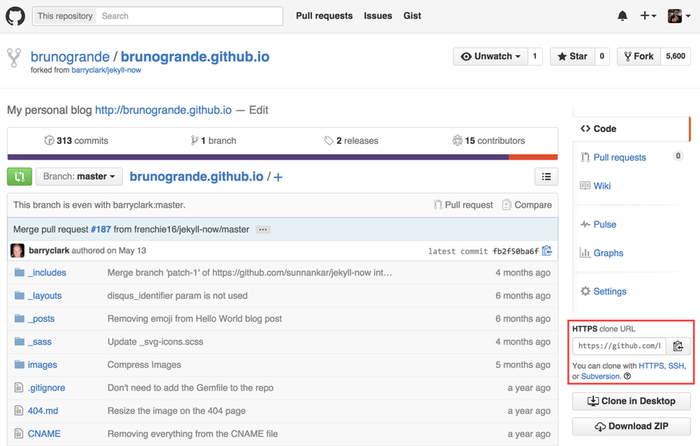
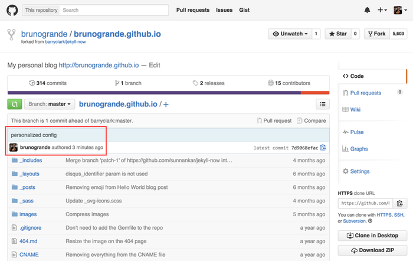

# Setting Up Your Online Presence Using GitHub Pages

- **Author**: Bruno Grande
- **Research field**: Cancer genomics, computational biology
- **Lesson Topic**: GitHub and Git

## Motivation

As the title suggests, this lesson is about setting up your
online presence using GitHub Pages. First, I'd like to explore 
a bit why you should concern yourself with creating a personal
space online. Let's be honest with ourselves: when we hear about
someone that we don't know much about, our reflex is to google
them, right? Well, believe it or not, people will (or already are)
doing that for you. Whether it's colleagues, collaborators or 
future employers, you probably want to leave a good first impression. 

What's the current status of your online presence? Take a look
yourself: open a new browser window in Incognito or Private 
mode and google your name. What comes up? Are any of 
the results on the first page related to you? For some of you, 
your LinkedIn profiles will show up and this is a good start. 
But the reality is that everyone can easily create one. You
can differentiate yourself and gain an edge over others by 
creating a website. You might not know HTML, CSS or JavaScript. 
You also might never have had experience with web hosting. 
This is where GitHub Pages comes in. 

GitHub Pages is a feature offered by GitHub that enables Git
repositories to act as websites. Don't worry though: you don't
need to fully understand Git to use GitHub Pages. In this lesson,
I will introduce some basic concepts to get started. Over time,
you will continue to learn about Git until you become proficient.
This will be worth your while: Git is a powerful version control
system that I recommend you all use. Many things can be tracked by
Git: code, papers, results, etc. Today, we'll focus on your personal
website. Let's get started then!

**Fun fact:** [SciProg.ca](http://sciprog.ca) is actually hosted on 
GitHub Pages. This just comes to show how powerful it can be.

## Lesson Notes

### Forking and Cloning a Template

You can write your own website from scratch, but that takes time
and knowledge about HTML, CSS, JavaScript and Jekyll, the underlying
platform used by GitHub Pages. Instead, we'll kickstart our website
by using a template. For this lesson, I'll be using the [Pixyll template]
(https://github.com/johnotander/pixyll), but there are [many options]
(http://jekyllthemes.org/) out there. I mostly learned HTML and CSS by
starting off with a template and tweaking it bit by bit. You can do the
same!

The Pixyll template repository is owned by [John Otander]
(https://github.com/johnotander), meaning that we can't edit it as is. 
We need to create a copy of the repository under our account first. This
is called forking the repository. You may visit the [repository page]
(https://github.com/johnotander/pixyll) and click the Fork button at the
top-right. If GitHub prompts your to select an account to store the fork
under, choose your personal GitHub account. 


Next, we need to tidy up our newly created repository fork. First, 
we need to rename it to `<username>.github.io`, where you replace 
`<username>` with your actual GitHub username. This will be your website
address. To rename your repository, visit the Settings page. 



Let's change the repository's description to something more adequate.
For example, the description can be "My Personal Website" and the
website will be the same URL as above, `<username>.github.io`. You
can edit the description by clicking the "Edit" link beneath the repository
name at the top. 


Now that we've done some tidying, we can download the repository. 
In the world of Git, this is done by cloning the repository. As the
name implies, you're creating an exact copy locally. To accomplish this,
copy the link located at the bottom right of the repository page. 
If you haven't set up SSH keys (or haven't heard of SSH keys), make
sure you click the small HTTPS link and then copy the repository link.



Now, open a Bash shell. Navigate to where you want to store your local 
copy of the website. For instance, I have a `Repos` directory. Then, 
run the git clone command using the link your copied. Git might ask
for your GitHub login information. You may avoid this by [setting up
SSH keys](https://help.github.com/articles/generating-ssh-keys/). 

```bash
# Create a Repos directory in your home folder
mkdir -p ~/Repos
# Change directory
cd ~/Repos
# Clone the website repository (replace <username>)
git clone https://github.com/<username>/<username>.github.io.git
```

You now have a local copy of your website repository! Also, if you
visit the URL (`username.github.io`), your website should be live. 
Of course, it isn't personalized yet, but this is what we're gonna
do next. 

### Personalizing your Website

Now that you've cloned your website repository, we need to make a few
changes. First of all, we need to delete the file called `CNAME`, which
is meant to be used for custom domains. Otherwise, we'll keep receiving
email notifications that the CNAME is already taken. 

```bash
# Enter your repository directory
cd <username>.github.io
# Delete the CNAME file
rm CNAME
```

This is a small change, but let's save it by committing it to the
Git repository. If you run `git status` in your repository, you'll
be given a list of changes. Here, we should only have one change: 
the CNAME file we deleted (see below for example output). 

```
On branch master
Your branch is up-to-date with 'origin/master'.
Changes not staged for commit:
  (use "git add/rm <file>..." to update what will be committed)
  (use "git checkout -- <file>..." to discard changes in working directory)

	deleted:    CNAME

no changes added to commit (use "git add" and/or "git commit -a")
```

When we commit a change like this one, it allows us to track each
edit we make and this grants us the power of reverting a specific 
change if we mess up. There are two steps to committing a change:

1. Adding the change to the stage. 
	- This allows us to pick and choose which changes we want to 
	commit first, in case there are multiple changes in the repository.
	- In our case, we only have one change, so this step seems a bit
	superfluous. It becomes more useful when your changes are more complex.
2. Commit the change. 
	- This step requires you to provide a message describing the change.
	This is useful when you are looking back at individual changes. 

Using the command-line, we achieve these steps as follows. 

```bash
# Include all changes made in the repository for the next commit
git add .
# Commit the changes by giving a message describing the change
git commit -m 'deleted CNAME file'
```

This change is now registered as a commit locally, but GitHub isn't
aware of the change yet. For that, we need to push the commits we've 
created since running `git clone` to GitHub. In this case, we only have
one. For this, you simply run `git push`. 

```bash
# Push your changes to GitHub.com
git push
```

Now, if you visit the GitHub page for your website, you should see your
commit. 


